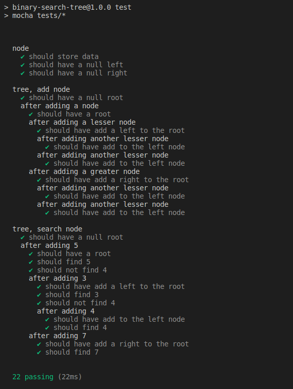

# Binary Search Tree

This code implements a Binary Search Tree in JavaScript, which is a data structure where each node has at most two child nodes, and the left child node has a value smaller than its parent, while the right child node has a value greater than its parent.

## Available Scripts

- Type `npm install` to install required packages
- Type `npm run test` to run tests

## Methods

- `addNode(node)`\
  This method adds a new node to the tree. It uses recursion to find position for new Node.
- `hasNode(data)`\
  This method searches the tree for a node with the given data value. It recursively searches for a node with the given data. If it finds the node with `data` in tree it returns true otherwise false.

## Test Results

## Acknowledgments

This challenge is part of [Alchemy University](https://university.alchemy.com)'s Ethereum Developer Bootcamp.
